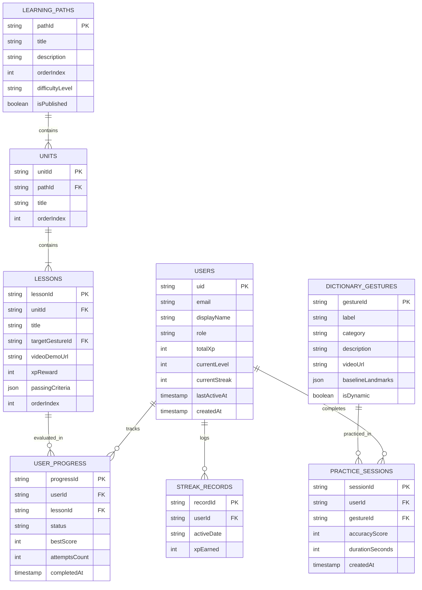

# SIGNBRIDGE Technical Architecture & Data Design

> **Document Version:** 1.0  
> **Status:** Approved / Specification Baseline  
> **Target Platform:** Mobile (React Native / Android SDK 26+ Primary, iOS Phase 2)  
> **Core AI Stack:** MediaPipe Hands + TensorFlow Lite (100% On-Device Inference)  
> **Backend & Cloud:** Firebase (Authentication, Cloud Firestore, Cloud Storage)

---

## 1. High-Level System Architecture

SIGNBRIDGE adopts an **Offline-First, Privacy-Preserving On-Device AI Architecture**. Video frames from the mobile camera are processed entirely in memory on the device's Neural Processing Unit (NPU) or GPU. No video feeds or raw images are ever sent over the network.

```mermaid
graph TB
    subgraph MobileDevice["Mobile Client (React Native + Native C++ Layer)"]
        subgraph HardwareUI["Hardware & UI Layer"]
            Camera["Device Camera (CameraX / VisionCamera)"]
            Screen["UI Components (React Native + Gluestack/Tailwind)"]
            Speaker["Text-To-Speech (TTS Engine)"]
        end

        subgraph AIPipeline["Edge AI Inference Pipeline (< 100ms)"]
            FrameProc["Frame Processor Worklet (30 FPS)"]
            MediaPipe["MediaPipe Hands (21 3D Landmarks)"]
            Normalizer["Landmark Normalizer (Scale & Translation Invariant)"]
            TFLite["TensorFlow Lite Inference Engine"]
            Smoother["Temporal Smoothing & Debounce Filter"]
        end

        subgraph StateLayer["Application & State Management"]
            Zustand["Zustand Store (Auth, Practice, Translation, Progress)"]
            LocalCache["AsyncStorage / SQLite Offline Cache"]
        end
    end

    subgraph FirebaseCloud["Firebase Cloud Infrastructure (HTTPS / TLS 1.3)"]
        FirebaseAuth["Firebase Auth (JWT, OAuth)"]
        Firestore["Cloud Firestore (User Data, Progress, Curricula)"]
        CloudStorage["Cloud Storage (Video Lessons, ASL Assets)"]
    end

    Camera -->|Raw Frame Buffer| FrameProc
    FrameProc --> MediaPipe
    MediaPipe -->|21 Keypoints (x, y, z)| Normalizer
    Normalizer -->|63D Feature Vector| TFLite
    TFLite -->|Raw Probabilities| Smoother
    Smoother -->|Stable Gesture Token| Zustand
    Zustand --> Screen
    Zustand --> Speaker

    Zustand <-->|Async Sync| LocalCache
    LocalCache <-->|Delta Sync when Online| Firestore
    FirebaseAuth <-->|Token Validation| Zustand
    CloudStorage -.->|Cached Download| LocalCache
```

---

## 2. On-Device AI / Vision Pipeline Specification

### 2.1 Landmark Coordinate Normalization
MediaPipe Hands detects 21 3D keypoints per hand ($x, y$ normalized to $[0, 1]$, and relative depth $z$). To make the classification model invariant to user distance, hand scale, and screen position, coordinates undergo a 3-step normalization:

1. **Translation Normalization (Wrist-Centric):**
   $$x'_i = x_i - x_0, \quad y'_i = y_i - y_0, \quad z'_i = z_i - z_0 \quad (\forall i \in [0, 20])$$
   where $(x_0, y_0, z_0)$ is Landmark #0 (Wrist). Landmark #0 becomes $(0, 0, 0)$.

2. **Scale Normalization:**
   Calculate reference distance $D_{ref} = \sqrt{(x_9 - x_0)^2 + (y_9 - y_0)^2 + (z_9 - z_0)^2}$ (distance between Wrist and Middle Finger MCP #9):
   $$X_i = \frac{x'_i}{D_{ref}}, \quad Y_i = \frac{y'_i}{D_{ref}}, \quad Z_i = \frac{z'_i}{D_{ref}}$$

3. **Feature Vector Representation:**
   The normalized coordinates produce a fixed 1D vector of length $63$:
   $$V = [X_0, Y_0, Z_0, X_1, Y_1, Z_1, \dots, X_{20}, Y_{20}, Z_{20}] \in \mathbb{R}^{63}$$

### 2.2 Dual-Model Architecture
The app handles both static and dynamic ASL gestures using specialized models:

| Gesture Class | Model Type | Input Shape | Model Size | Target Latency |
| :--- | :--- | :--- | :--- | :--- |
| **Static Gestures** (Alphabet A-Z, Numbers 1-9, Static Words) | Multi-Layer Perceptron (MLP) / 1D-CNN | `[1, 63]` | $\approx 2.4\text{ MB}$ | $< 15\text{ ms}$ |
| **Dynamic Gestures** (J, Z,Phrases, Motion Words) | Bidirectional LSTM / GRU with Temporal Window | `[1, 30, 63]` (30 frames buffer $\approx 1\text{s}$) | $\approx 6.8\text{ MB}$ | $< 35\text{ ms}$ |

### 2.3 Prediction Stabilization & Debouncing
To prevent visual flickering in real-time translation:
- **Confidence Threshold:** Only predictions with $\text{Softmax Confidence} \ge 0.85$ are accepted.
- **Sliding History Window:** The final output token requires $\ge 4$ consecutive frames of matching predictions before emitting a translated character/word.
- **Repetition Debounce:** A debounce lockout of $400\text{ ms}$ is enforced before the same character can be repeated unless an explicit neutral hand posture is detected.

---

## 3. Database Schema (Cloud Firestore)

### 3.1 Entity Relationship Diagram (ERD)



### 3.2 Firestore Collections & Document Specifications

#### 1. Collection `users/{uid}`
```typescript
interface UserDocument {
  uid: string;
  email: string;
  displayName: string;
  avatarUrl?: string;
  role: "user" | "educator" | "admin";
  totalXp: number;
  currentLevel: number;
  currentStreak: number;
  longestStreak: number;
  lastActiveDate: string; // Format: YYYY-MM-DD
  preferences: {
    dominantHand: "left" | "right";
    enableTtsVoice: boolean;
    speechSpeed: number; // 0.5 to 1.5
    hapticFeedback: boolean;
  };
  createdAt: FirebaseFirestore.Timestamp;
  updatedAt: FirebaseFirestore.Timestamp;
}
```

#### 2. Collection `dictionary_gestures/{gestureId}`
```typescript
interface DictionaryGestureDocument {
  gestureId: string;
  label: string; // e.g. "HELLO", "THANK_YOU", "A"
  category: "alphabet" | "number" | "greeting" | "emergency" | "daily";
  difficulty: "beginner" | "intermediate" | "advanced";
  description: string;
  tips: string[];
  videoUrl: string;
  thumbnailUrl: string;
  isDynamic: boolean;
  baselineLandmarks: {
    wrist: [number, number, number];
    keypoints: number[][]; // 21 x 3 normalized coords
    toleranceThreshold: number; // e.g. 0.82
  };
}
```

#### 3. Collection `user_progress/{uid_lessonId}`
```typescript
interface UserProgressDocument {
  id: string; // composite: `${uid}_${lessonId}`
  userId: string;
  lessonId: string;
  status: "locked" | "available" | "in_progress" | "completed";
  bestAccuracy: number; // 0 - 100
  stars: 1 | 2 | 3;
  attemptsCount: number;
  firstCompletedAt?: FirebaseFirestore.Timestamp;
  lastAttemptAt: FirebaseFirestore.Timestamp;
}
```

---

## 4. State Management (Zustand Architecture)

The application maintains four isolated, performant Zustand stores:

```
src/stores/
├── useAuthStore.ts        # User credentials, JWT, profile, auth state listener
├── usePracticeStore.ts    # Real-time camera state, similarity score, visual feedback
├── useTranslationStore.ts # Live translation buffer, sentence accumulator, TTS control
└── useLearningStore.ts    # Course curriculum, lesson progress, offline cached assets
```

### Store Interaction & Data Isolation Example:
- **`usePracticeStore`**: Subscribes directly to frame-processor worklet outputs via an event emitter or JSI binding to guarantee zero React re-render lags. The UI consumes an animated value (`useSharedValue`) for the similarity gauge.
- **`useTranslationStore`**: Holds `tokens: string[]`, `confidence: number`, `isListening: boolean`. Emits speech via `SpeechService` whenever word delimiter gestures or punctuation triggers occur.

---

## 5. Security & Privacy Architecture

### 5.1 Privacy Guarantees
1. **Zero Camera Frame Transmission:** No native camera buffers, raw image arrays, or video files are permitted to cross network boundaries. Network intercepts are blocked via App Transport Security and strict CSP.
2. **On-Device Biometric Anonymization:** Extracted landmark coordinates represent purely abstract geometric points and cannot reconstruct facial or biometric identities.

### 5.2 Firestore Security Rules
```javascript
rules_version = '2';
service cloud.firestore {
  match /databases/{database}/documents {
    function isAuthenticated() {
      return request.auth != null;
    }
    function isOwner(userId) {
      return isAuthenticated() && request.auth.uid == userId;
    }

    match /users/{userId} {
      allow read: if isAuthenticated();
      allow write: if isOwner(userId);
    }

    match /dictionary_gestures/{gestureId} {
      allow read: if true;
      allow write: if isAuthenticated() && request.auth.token.role == "admin";
    }

    match /user_progress/{progressId} {
      allow read, write: if isAuthenticated() && resource.data.userId == request.auth.uid;
      allow create: if isAuthenticated() && request.resource.data.userId == request.auth.uid;
    }
  }
}
```

---

## 6. Offline-First & Asset Caching Strategy

1. **Model Bundling:** The Core ASL Static Alphabet `.tflite` model ($\approx 2.4\text{ MB}$) is bundled directly inside the APK assets directory. The app is functional immediately after installation without internet connectivity.
2. **Video Asset Caching:** High-definition demonstration videos use an LRU disk cache (`react-native-blob-util` or `expo-file-system`) capped at $200\text{ MB}$.
3. **Firestore Offline Persistence:** Enabled via `enableIndexedDbPersistence()` / Native offline cache, allowing progress and streak tracking to function offline and sync deltas automatically when connection restores.
