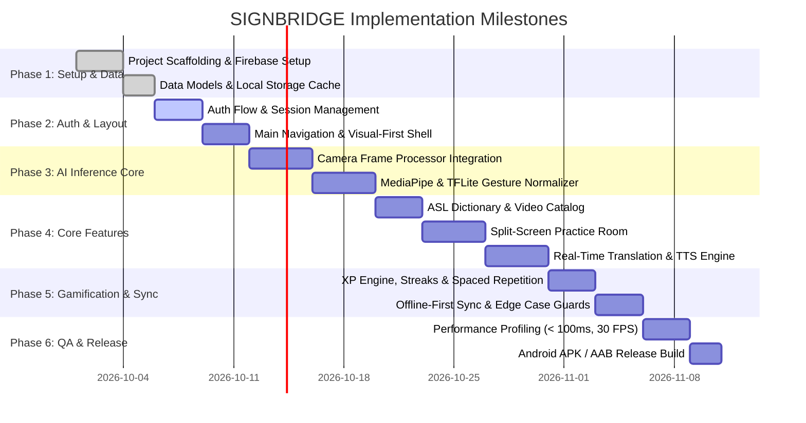

# SIGNBRIDGE Implementation Roadmap & AI Prompt Execution Guide

> **Document Version:** 1.0  
> **Status:** Active Execution Plan  
> **Methodology:** Spec-Driven AI Development (Phần 3 & 4 Cẩm nang Full-Stack AI)  
> **Architecture Reference:** `@docs/ARCHITECTURE.md` | **Product Requirements:** `@docs/PRD.md`

---

## 1. Project Phase Breakdown & Checklist



---

## 2. Step-by-Step AI Prompting Playbook (From A to Z)

### Bước 1: Khởi tạo khung dự án & Cấu hình dịch vụ (Scaffolding & Config)
**Mục tiêu:** Tạo bộ khung React Native / Expo với TypeScript strict mode, cấu hình Firebase SDK, Zustand, và thiết lập cấu trúc thư mục chuẩn theo `AGENTS.md`.

- [ ] Khởi tạo project React Native (Expo Prebuild / TypeScript).
- [ ] Cấu hình `tsconfig.json` (strict: true, không dùng `any`).
- [ ] Thiết lập kết nối Firebase (Auth, Firestore, Storage) và file `.env.example`.
- [ ] Khởi tạo các thư mục `/src/app`, `/src/components`, `/src/features`, `/src/ml`, `/src/stores`.

> **PROMPT 1: PROJECT SCAFFOLDING & CONFIGURATION**
> ```text
> "Hãy đọc file @AGENTS.md và @docs/ARCHITECTURE.md .
> Hãy khởi tạo cấu trúc thư mục mã nguồn chuẩn cho dự án SIGNBRIDGE.
> Thiết lập cấu hình TypeScript nghiêm ngặt (strict mode), file env validation bằng Zod,
> và cài đặt module khởi tạo Firebase client (Auth, Firestore, Cloud Storage) với cơ chế offline persistence.
> Hãy giải thích ngắn gọn 3 bước trước khi tạo code."
> ```

---

### Bước 2: Triển khai Authentication & Navigation Shell
**Mục tiêu:** Xây dựng hệ thống đăng nhập/đăng ký bằng Firebase Auth, đồng bộ Zustand store, và dựng layout điều hướng (Bottom Tabs: Learn, Practice, Translate, Dictionary, Profile).

- [ ] Tạo Zod validation schema cho Auth (Email RFC 5322, Mật khẩu $\ge 8$ ký tự, khớp Confirm Password).
- [ ] Triển khai `useAuthStore.ts` (Zustand) lắng nghe `onAuthStateChanged`.
- [ ] Tạo màn hình Login & Register với trạng thái Loading, Disable nút khi submitting, và Toast thông báo.
- [ ] Tạo bộ khung Navigation (5 Tabs chính) với thiết kế Visual-First (ưu tiên icon và trạng thái rõ ràng).

> **PROMPT 2: AUTHENTICATION & NAVIGATION LAYOUT**
> ```text
> "Hãy đọc @docs/5-feature-specification/3.5-feature-specification.md mục FR-001, FR-002 và @docs/ARCHITECTURE.md.
> Hãy triển khai:
> 1. useAuthStore.ts bằng Zustand quản lý user session, đăng ký, đăng nhập và đăng xuất.
> 2. Màn hình AuthScreen gồm form Login và Register kết hợp React Hook Form + Zod.
> 3. Cấu hình Navigation chính gồm Bottom Tab Bar với 5 tab: Học tập, Luyện tập, Phiên dịch trực tiếp, Từ điển, và Cá nhân.
> Đảm bảo kiểm tra các mã lỗi failure paths (E1-E5) đúng như đặc tả."
> ```

---

### Bước 3: Xây dựng On-Device AI Pipeline & Camera Frame Processor
**Mục tiêu:** Tích hợp `react-native-vision-camera`, cài đặt worklet trích xuất 21 điểm landmarks của MediaPipe Hands, chuẩn hóa vector 63 chiều và chạy TFLite inference.

- [ ] Cấu hình quyền truy cập Camera (Camera Permission Handler).
- [ ] Viết hàm toán học chuẩn hóa tọa độ `normalizeLandmarks(rawKeypoints)` (Wrist-centric & Scale invariant theo Section 2.1 của ARCHITECTURE.md).
- [ ] Thiết lập Frame Processor Worklet chạy off-thread ở tốc độ $30\text{ FPS}$.
- [ ] Tích hợp mô hình TFLite và bộ lọc Debounce/Smoothing buffer ($\ge 4$ frames liên tiếp, confidence $\ge 0.85$).

> **PROMPT 3: ON-DEVICE AI & CAMERA PIPELINE**
> ```text
> "Hãy đọc kỹ Phần 2 trong @docs/ARCHITECTURE.md về AI Pipeline.
> Hãy viết module nhận diện cử chỉ On-Device cho SIGNBRIDGE:
> 1. File src/ml/normalizers/landmarkNormalizer.ts: Chuẩn hóa 21 điểm MediaPipe về gốc tọa độ cổ tay (0,0,0) và chia khoảng cách D_ref để vector 63D có tính bất biến vị trí và tỉ lệ.
> 2. File src/ml/gestureClassifier.ts: Tải model TFLite, chạy inference và áp dụng bộ đệm trượt (Sliding History Window >= 4 frames, confidence >= 0.85) để chống giật rung (debouncing).
> 3. Tạo hook useCameraGestureDetection.ts kết nối với VisionCamera frame processor worklet."
> ```

---

### Bước 4: Xây dựng Giao diện người dùng (UI Components & Core Modules)
**Mục tiêu:** Ghép nối AI Pipeline vào 3 tính năng cốt lõi: Từ điển, Phòng luyện tập chia đôi màn hình, và Màn hình phiên dịch trực tiếp.

- [ ] **Màn hình Từ điển (Dictionary):** Tìm kiếm cử chỉ, phân loại category, modal xem video mẫu.
- [ ] **Phòng Luyện tập (Practice Room):** Giao diện chia đôi màn hình (nửa trên video mẫu, nửa dưới camera người dùng), hiển thị thanh đo độ tương đồng (%) theo thời gian thực.
- [ ] **Phiên dịch trực tiếp (Translate):** Camera toàn màn hình, khung nhận diện bàn tay, hộp thoại phụ đề trực tiếp và nút bấm phát âm Text-to-Speech.

> **PROMPT 4: PRACTICE ROOM & REAL-TIME TRANSLATION UI**
> ```text
> "Hãy đọc @docs/PRD.md và @docs/ARCHITECTURE.md.
> Hãy triển khai 2 màn hình quan trọng nhất của SIGNBRIDGE:
> 1. PracticeRoomScreen.tsx: Giao diện Split-screen. Nửa trên phát video demo cử chỉ mục tiêu. Nửa dưới mở camera selfie với overlay khung xương bàn tay và thanh đo độ chính xác (Accuracy Gauge) cập nhật realtime từ usePracticeStore.
> 2. TranslationScreen.tsx: Camera live dịch liên tục cử chỉ ASL ra văn bản ở phụ đề bên dưới. Tích hợp nút Text-to-Speech (TTS) để đọc to câu vừa dịch cho người nghe đối diện.
> Tuân thủ nguyên tắc Visual-First, hỗ trợ haptic feedback khi cử chỉ được nhận diện chính xác."
> ```

---

### Bước 5: Gamification, Offline Persistence & Xử lý Edge Cases
**Mục tiêu:** Hệ thống tính điểm XP, chuỗi ngày học (streaks), lưu trữ cache ngoại tuyến và xử lý các lỗi phần cứng/môi trường.

- [ ] Triển khai logic tính XP khi hoàn thành bài học, cập nhật chuỗi Streak theo ngày.
- [ ] Bật cơ chế offline cache cho Firestore và video caching cục bộ.
- [ ] Xử lý Edge Cases: Ánh sáng yếu (Low Light HUD alert), không phát hiện thấy bàn tay, nhiều người trong khung hình.
- [ ] Xử lý Error Boundaries và khôi phục khi camera bị ngắt quãng.

> **PROMPT 5: GAMIFICATION, OFFLINE CACHE & EDGE CASES**
> ```text
> "Hãy đọc @docs/5-feature-specification/3.5-feature-specification.md và @docs/ARCHITECTURE.md mục 6.
> Hãy hoàn thiện:
> 1. Logic tính thưởng XP và chuỗi streak tại src/features/gamification/streakService.ts. Đảm bảo dữ liệu ghi vào cache cục bộ trước và tự động đồng bộ lên Firestore khi có mạng.
> 2. Xử lý các Edge Cases camera: Cảnh báo khi môi trường thiếu sáng, hiển thị hướng dẫn khi bàn tay nằm ngoài vùng quét an toàn (Safe Zone HUD).
> 3. Viết 3 unit test bằng Vitest/Jest kiểm tra thuật toán chuẩn hóa landmark và logic duy trì chuỗi streak."
> ```

---

### Bước 6: Kiểm thử hiệu năng, Tối ưu FPS & Build Production
**Mục tiêu:** Đo lường độ trễ (< 100ms), rà soát rò rỉ bộ nhớ, kiểm tra type TypeScript toàn dự án và đóng gói APK.

- [ ] Kiểm tra lỗi type toàn dự án (`npx tsc --noEmit`).
- [ ] Đo đạc FPS và mức tiêu thụ RAM/pin khi camera chạy liên tục.
- [ ] Rà soát danh sách biến môi trường trong `.env.example`.
- [ ] Tạo hướng dẫn build file APK Android Standalone để cài đặt chạy thử nghiệm trên thiết bị thật.

> **PROMPT 6: PERFORMANCE PROFILING & PRODUCTION BUILD**
> ```text
> "Rà soát toàn bộ dự án SIGNBRIDGE chuẩn bị đóng gói bản thử nghiệm Android:
> 1. Chạy kiểm tra type toàn diện (tsc --noEmit) và sửa các lỗi type còn tồn đọng nếu có.
> 2. Tối ưu bộ nhớ: Đảm bảo giải phóng Camera frame buffer và TFLite interpreter khi component unmount.
> 3. Tạo file hướng dẫn cấu hình EAS Build / Gradle để xuất bản file APK Android hoàn chỉnh phục vụ kiểm thử nghiệm thu."
> ```
